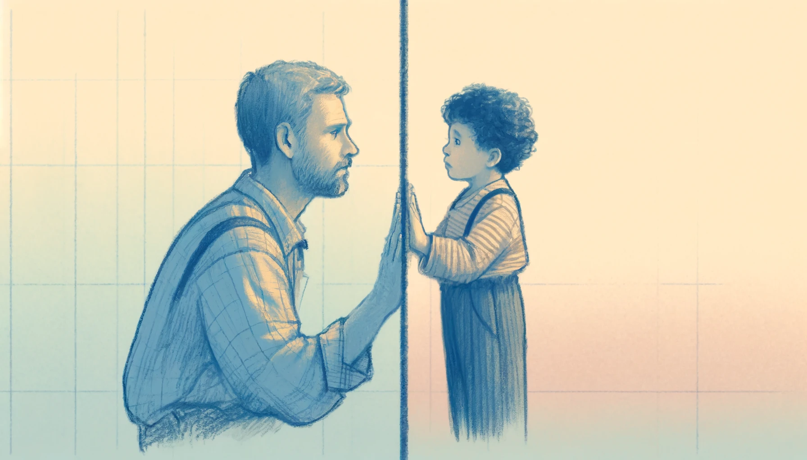
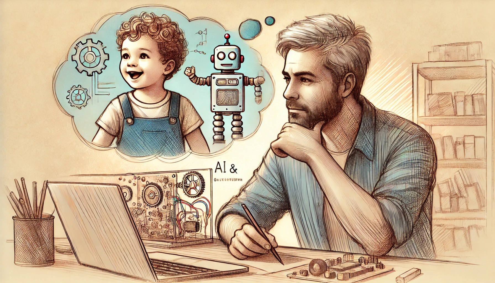

# Henryk AI Analysis and Generation
Primary purpose for this project is to build a plaform that will allow my audio recordings and other content to reach my alienated son, over many channels - and one day he would see how much legacy and love is waiting for him. 

I am a loving father of a 3y old Henry and my son is being alienated from me for more than 2.5 years. I am doing everything in my power to maintain the connection to my son despite the situation. This results in a huge number of audio recordings for him and also this data science and automation project.

This project serves also a therapeutic role for me - while waiting
for the court system to find their own backside, I have to deal with the ever-agressive patterns of Parental Alienation. But his is nothing. I can deal with it. I have a therapist and a circle of friends who support me no matter what. But my son has only his mother.
And it is his mother that is taking away from him the love, support and closenes of a loving parent.
I cannot imagine what he must be going through. He is only 3y old, but the separation and ever present hatred combined with obsessive efforts to isolate him from his father - must have taken a toll on this young one.

My heart bleeds at the slightest mention or thought of this. And then ... I sit and build.
I build my life. Build my career. Build great technologies. build this project. For the hope that one day I 
will be able to share this with him. And maybe, just maybe, I will see him smile some day.

This project focuses on over 500+ audio recordings that I have recorded for my son - and continue to do so. Those recordings were and are my attempt to connect to my son an let him at least hear my voice. 

In those recordings I am telling him the stories. Stories from my life, his family here, friends and things - like animals, phenomena, stars, nature and more. With the hope that one day he may doscover it all and take on a journey to learn about his father. 

Those recordings are processed, information is extracted and will be delivered to different channels - that being
text, that being videos and stories, that may one day reach my sone despite the ever present dome of fear and hatred.

As a side effect of the work I do on the AI and automation - I was able to build powerful statistical reasoning
framework for my court case - and a mount of objective evidence that no one will be able to question. Making this project
public allows me to claim transparency and share with everyone the tools, methods, methodology and the craft that
I did use to make this everything happen.

I can only hope that
statistical analysis of the data available to me would reveal patterns
of his mother behaviour that I can submit to the court as evidence

## Components
As of now following components of the analysis were developed

- **recordings** - analysis of my recordings for Henry, that is their duration, frequency and other stats. Now it also has automated transcription and automated classification through NLP reasoning over some well crafter prompts - that anyone can run on the same data that I have had available. And achieve similar results. 
- **visits** - analysis of my meetings with Henry. Mainly the analysis of the probabilities of certain events such as Henry's sickness that conicidentally happend during my visits and other things

**IMPORTANT**

Recordings and transcriptions are not publically available yet. They are encrypted and my lawyers are looking into them (yesss, all 500+ of them) and will tell me if I can release them to the public. Once I do this - chances that one of those humble recordings gets finally to my son ... I can't even think of it. Videos will follow. But those videos will be based on the recordings thanks to a technogy that is cooking on my RTX 4090 GPU as we speak. Hush. 

Feel free to play with the datasets available in the `data/processed`, specifically the classification datasets. Super interesting. You will like it. 

## Installation
- You need conda based environment to run this. you can use a prebuilt environment available as docker-compose project: [stellars-jupyterlab-ds](https://github.com/stellarshenson/stellars-jupyterlab-ds) that I have created an my entire data science team uses it in my company for work. my project makes use of free miniforge with conda-forge repository.
- you need to execute `make install_all` to install all dependencies from the environment file and the library

feel free to contact me if you need any help
