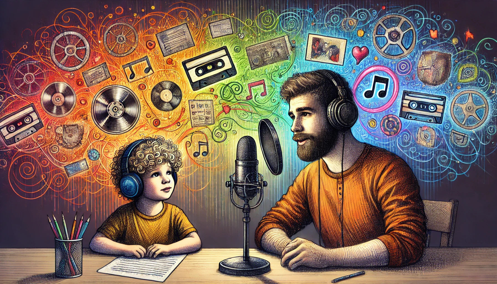
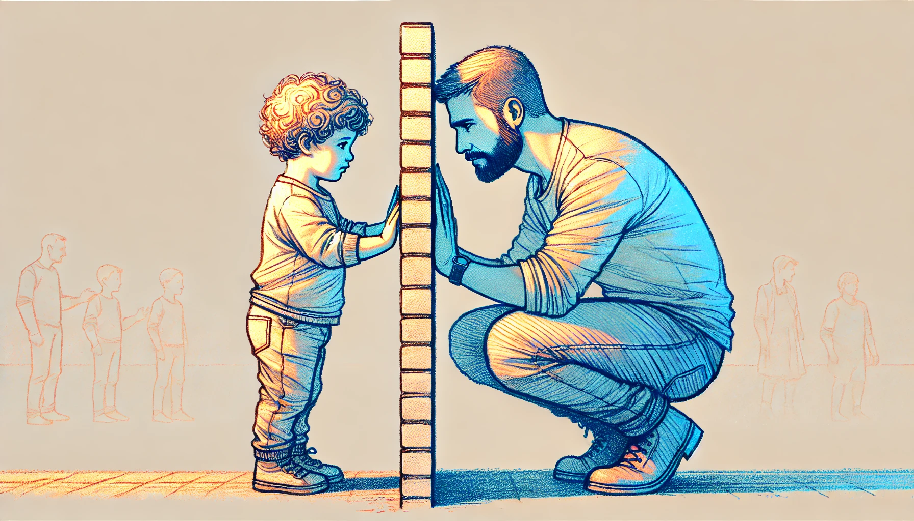
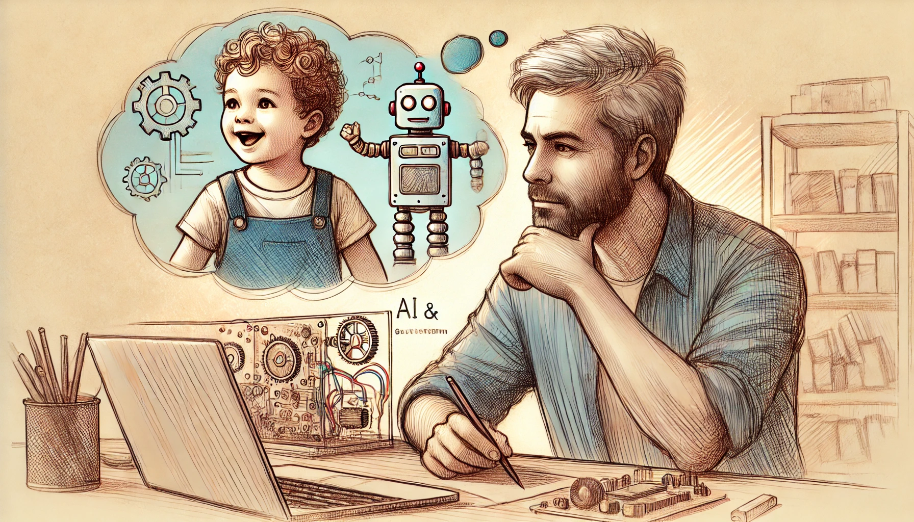

# Henry Project "Hope" - AI Analysis and Generation

<a target="_blank" href="https://cookiecutter-data-science.drivendata.org/">
    
</a>

## Purpose

The primary goal of this project is to create a platform that allows my audio recordings and other content to reach my alienated son, Henry, through various channels. My hope is that one day he will see the legacy and love that has always been there for him.



I am a loving father to my 3.5-year-old son, Henry, who has been alienated from me for more than 3 years. Despite the challenging circumstances, I am determined to maintain a connection with him. This has led to a significant number of audio recordings and the development of this data science and automation project.


This project also serves a therapeutic purpose for me. As I wait for the court system to take action, I must deal with the aggressive patterns of Parental Alienation. Although it is difficult, I am resilient. I have the support of a therapist and a circle of friends. However, my son doesn't have that kind of support system and he is and noone to turn to. I cannot imagine what he is going through, being only 3 years old and subjected to separation and constant attempts to isolate him from his father.



My heart aches at the thought of this, but then I focus on building. I build my life, my career, and great technologies. This project is built with the hope that one day I will be able to share it with him and see him smile.

## Project Focus

This project revolves around over 700+ audio recordings (almost 200 hours) that I have made for my son, and I continue to make more. These recordings are my way of trying to connect with him and let him hear my voice. In these recordings, I share stories from my life, our family, friends, and various topics like animals, phenomena, stars, nature, and more. My hope is that one day he will discover these recordings and embark on a journey to learn about his father.

The recordings are processed, information is extracted, and they will be delivered through various channels such as text, videos, and stories. These may eventually reach my son despite the current barriers of fear and hatred.

As a side effect of my work on AI and automation, I have built a powerful statistical reasoning framework for my court case, accumulating objective evidence that is hard to dispute. By making this project public, I aim also to claim transparency and share the tools, methods, and methodologies I used to make this happen.



I hope that the statistical analysis of the available data will reveal parental alienation patterns that I can use to help my son and restore our connection.

## Components

Currently, the following components of the analysis have been developed:

- **Recordings**: Analysis of my recordings for Henry, including their duration, frequency, and other statistics
- **Transcriptions**: Automated transcription via GoodTape API
- **Classification**: NLP reasoning with well-crafted prompts via OpenAI GPT models
- **Visits**: Analysis of my meetings with Henry, focusing on probabilities of certain events such as Henry's sickness coinciding with my visits and other occurrences

**IMPORTANT**

The recordings and transcriptions are not yet publicly available. They are encrypted, and my lawyers are reviewing them. Once I receive approval, I will release them to the public, increasing the chances that one of these humble recordings might finally reach my son. Videos will follow, created based on the recordings using technology currently in development.

Feel free to explore the datasets available in the `data/processed` directory, especially the classification datasets. They are fascinating and worth a look.

## Quick Start

```bash
make install
```

Or with pip:
```bash
pip install -e ".[dev]"
```

You can also use a prebuilt environment available as a Docker-compose project: [stellars-jupyterlab-ds](https://github.com/stellarshenson/stellars-jupyterlab-ds), which I created and my entire data science team uses in my company. This project utilises the free Miniforge with the conda-forge repository.

## Makefile Targets

- `make install` - Create environment and install package
- `make test` - Run tests
- `make lint` / `make format` - Check / fix code style
- `make build` - Build distributable wheel
- `make clean` - Remove compiled files and caches
- `make docs` / `make docs_serve` - Build / serve documentation
- `make help` - Show all available targets

## Technology Stack

- **Data Processing**: pandas, polars, pyarrow, numpy
- **AI/NLP**: OpenAI API, transformers, json_repair
- **Audio**: pydub, ffmpeg-binaries
- **Visualization**: matplotlib, seaborn, plotly, wordcloud
- **Document Generation**: python-docx, markdown-it-py
- **Logging**: loguru, colorama
- **CLI**: typer, click
- **Development**: ruff, pytest, mkdocs

## Notebook Pipeline

1. **Generate recordings stats** - Extract metadata from audio files
2. **Analyse recordings stats** - Statistical analysis and visualization
3. **Transcribe recordings** - Audio to text via GoodTape API
4. **Generate recordings descriptions** - AI-powered descriptions
5. **Analyse transcription classifications** - NLP classification analysis
6. **Generate images for recordings** - Visual content generation
7. **Generate videos from recordings** - Video content generation

## Project Organization

```
├── Makefile               <- Makefile with convenience commands
├── README.md              <- The top-level README for developers
├── data
│   ├── external           <- Data from third party sources
│   ├── interim            <- Intermediate data that has been transformed
│   ├── processed          <- The final, canonical data sets for modeling
│   └── raw                <- The original, immutable data dump
│
├── docs                   <- Documentation (mkdocs)
├── models                 <- Trained and serialized models
├── notebooks
│   └── recordings         <- Jupyter notebooks for recordings analysis
├── resources              <- Templates and prompts
├── pyproject.toml         <- Project configuration and dependencies
├── references             <- Data dictionaries, manuals, explanatory materials
├── reports
│   └── figures            <- Generated graphics and figures
├── tests                  <- Test files
└── lib_henryk_analysis    <- Source code for this project
    ├── __init__.py
    ├── config.py          <- Configuration variables and paths
    ├── logger.py          <- Logging utilities, progress bars
    ├── utils.py           <- General utilities
    ├── dataset.py         <- Data download/generation scripts
    ├── features.py        <- Feature engineering code
    ├── plots.py           <- Visualization code
    ├── recordings/        <- Recording processing submodule
    │   ├── recordings.py  <- File discovery, metadata extraction
    │   ├── transcriptions.py <- Transcription processing
    │   └── classification.py <- OpenAI GPT classification
    └── modeling/
        ├── predict.py     <- Model inference
        └── train.py       <- Model training
```

## Data Files

The processed data files available in `data/processed/`:

- `henryk_recordings_stats.parquet` - Recording statistics
- `henryk_recordings_transcriptions.parquet.zip` - Transcriptions (compressed)
- `henryk_transcriptions_classifications.parquet` - NLP classifications
- `henryk_transcriptions_classifications_stats.parquet` - Classification statistics

## Contact

Feel free to contact me if you need any help.
